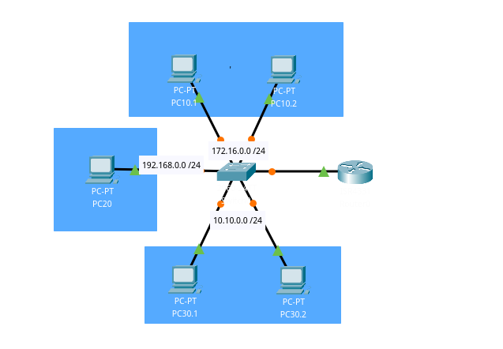

## Concept
An access control list (ACL) is a list of rules that specifies which users or systems are granted or denied access to a particular object or system resource. Access control lists are also installed in routers or switches, where they act as filters, managing which traffic can access the network. (Credits: [TechTarget](https://www.techtarget.com/searchnetworking/definition/access-control-list-ACL))

## Bullet points:
- Each PC was named after its VLAN
- Router is responsible for traffic across VLANs (through the interface Gigabit Ethernet 0/0/0)
- There is a subinterface for each VLAN on the router
- PC 10.1 should not be able to communicate with PC 30.1
- PC 10.1 should be able to communicate with PC 30.2
- PC 10.2 should not be able to communicate with PC 30.2
- PC 10.2 should be able to communicate with PC 30.1
- Everyone should be able to communicate with PC20
- On the router, on each subinterface we have an access list for the Egress action to create all the rules above mentioned.
- Subinterfaces 0/0/0.1 and .3 on the router have an access-list each attached to it for the out (outbound packets) option

Access lists on the router:
```
Extended IP access list vlan10
    10 deny ip host 10.10.0.3 host 172.16.0.3
    20 deny ip host 10.10.0.4 host 172.16.0.4
    1000 permit ip any any
Extended IP access list vlan30
    10 deny ip host 172.16.0.3 host 10.10.0.3
    20 deny ip host 172.16.0.4 host 10.10.0.4
    1000 permit ip any any
```

