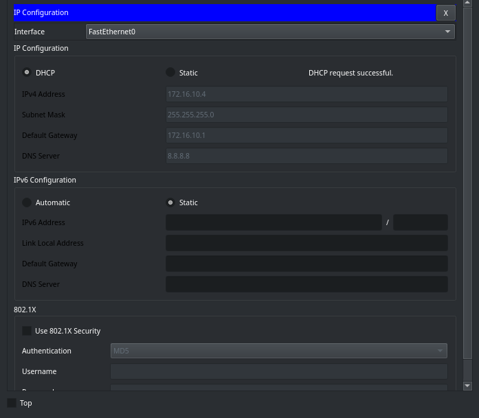
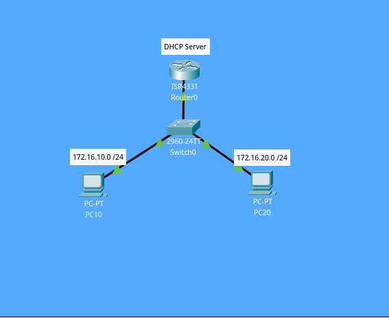

## Concept
The Dynamic Host Configuration Protocol is a network management protocol used on Internet Protocol networks for automatically assigning IP addresses and other communication parameters to devices connected to the network using a client–server architecture. [Credits: [Wikipedia](https://en.wikipedia.org/wiki/Dynamic_Host_Configuration_Protocol)]

Bullet points:
- Two VLANs, each with one PC, connected to a Router. 
- The Router is the DHCP server
- The first two IPs of each subnet are excluded on the DHCP server.
- Each PC is named after its VLAN.

  

