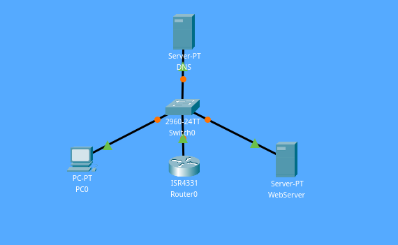

## Concept
The Domain Name System is the hierarchical and decentralized naming system used to identify computers reachable through the Internet or other Internet Protocol networks. The resource records contained in the DNS associate domain names with other forms of information. (Credits: [Wikipedia](https://en.wikipedia.org/wiki/Domain_Name_System))

## Bullet points:
- DHCP server handing out IPs for network 192.168.0.0 /24
- 192.168.0.1 is excluded from the DHCP Server's pool as it is the router.
- 192.168.0.2 is excluded from the DHCP Server's pool as it is the DNS Server.
- 192.168.0.3 was the IP handed out to the WebServer
- 192.168.0.4 was the IP handed out to the Client Host
- ermonaites.com is configured as a domain in the DNS Server and its IP address is 192.168.0.3
- www.ermonaites.com is an CNAME record pointing to ermonaites.com
- Our WebServer is hosting an HTTP Web page

