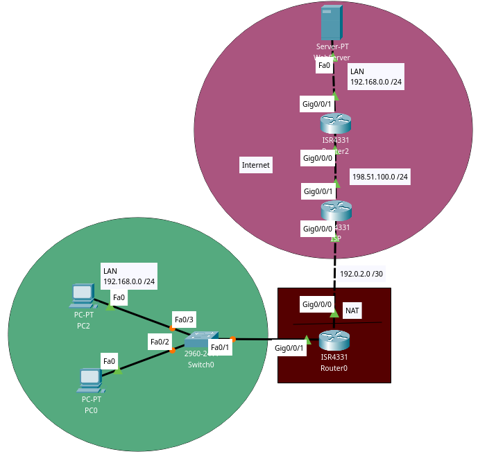

## Concept
Dynamic NAT is a many-to-one mapping of a private IP address or subnets inside the SD-WAN network to a public IP address or subnet outside the SD-WAN network. The traffic from different zones and subnets over trusted (inside) IP addresses in the LAN segment is sent over a single public (outside) IP address. (Credits: [Citrix](https://docs.citrix.com/en-us/citrix-sd-wan/current-release/security/network-address-translation/configure-dynamic-nat.html))

## Bullet points:
- This project is very much like the [Static NAT Project](../static-nat/static-nat.pkt), the only change here is that the network on the bottom-left is using dynamic NAT now for its multiple hosts.
- There is a NAT Pool on the Gateway with addresses ranging from 192.0.2.3 to 192.0.2.8
- There is an Access List on the Gateway attached to the NAT pool permitting traffic from 192.168.0.x (this way NAT will be applied to all of the hosts on the LAN)


NAT Pool Info:
```
Outside Interfaces: GigabitEthernet0/0/0
Inside Interfaces: GigabitEthernet0/0/1
Dynamic mappings:
-- Inside Source
access-list Workstations pool Public-Pool refCount 0
 pool Public-Pool: netmask 255.255.255.0
       start 192.0.2.3 end 192.0.2.8
       type generic, total addresses 6 , allocated 0 (0%), misses 0
```
Access List attached to the pool info:
```
Extended IP access list Workstations
    10 permit ip 192.168.0.0 0.0.0.255 any
```

On the example bellow we can see a packet arriving at our Gateway (coming from an Inside Local Address) and having NAT applied to it

As a proof of concept, we can see that when the packet arrives at the ISP router, the source IP is not a private one but one provided by our Gateway

