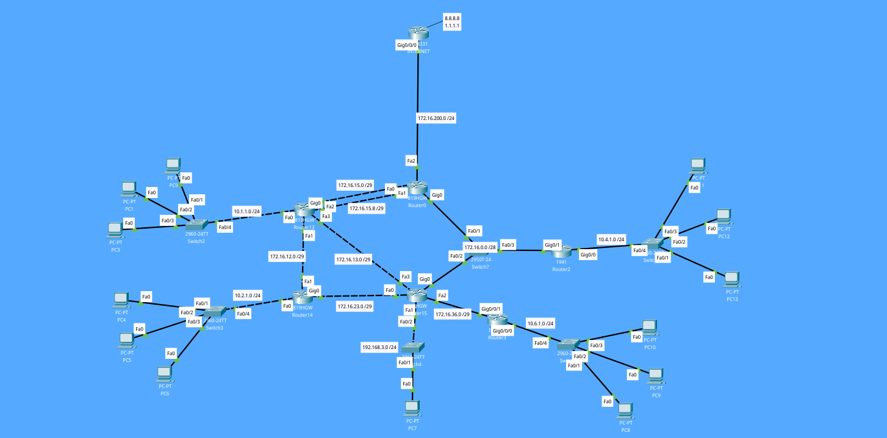

## Concept
Dynamic routing is a technique in which a router learns about routing information without an administrator's help and adds the best route to its routing table. A router running a dynamic routing protocol adds the best route to its routing table and can also determine another path if the primary route goes down. (Credits: [Section.io](https://www.section.io/engineering-education/understanding-static-dynamic-routing/))

## Bullet points:
- Protocol used: RIP
- Each LAN has a DHCP Server configured (on its respective router)
- There is only one router sending update messages with a default-route configured
- There is no authentication on receiving and sending the RIP messages because of lack of compatibility between the routers in this software and RIP's authentication

