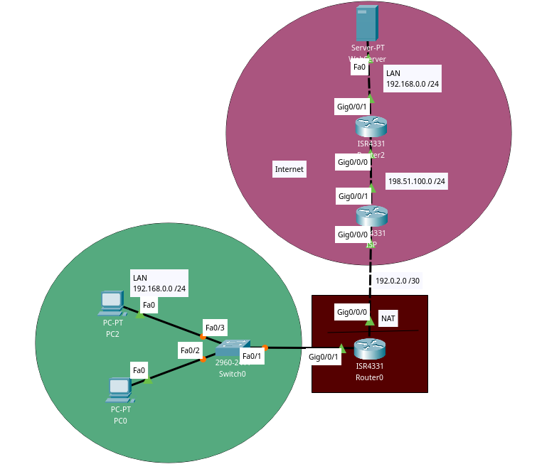
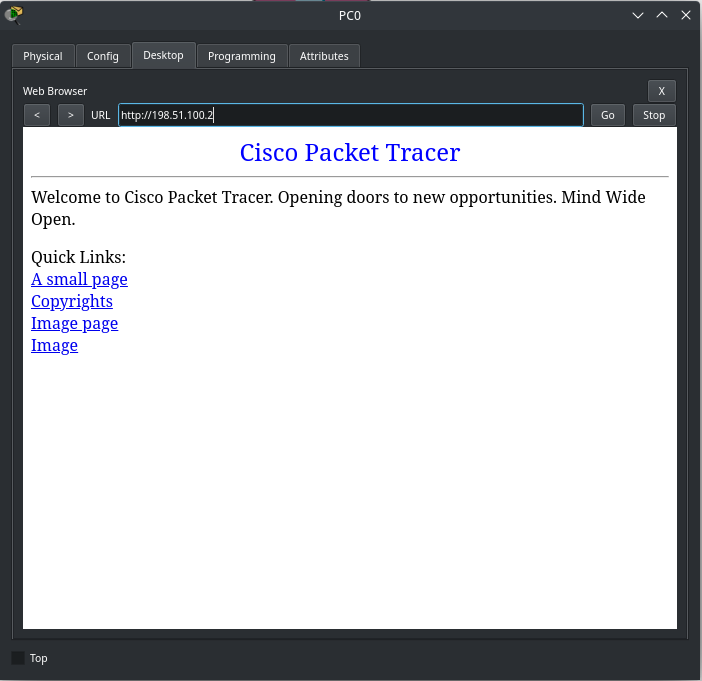

Bullet points:
- The WebServer has an HTTP server running on port 80 (which is accessible by clients on their browsers)
- The WebServer's router is forwarding traffic coming to its port 80 to the WebServer on port 80 using PAT.

