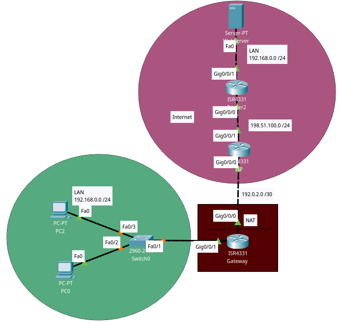
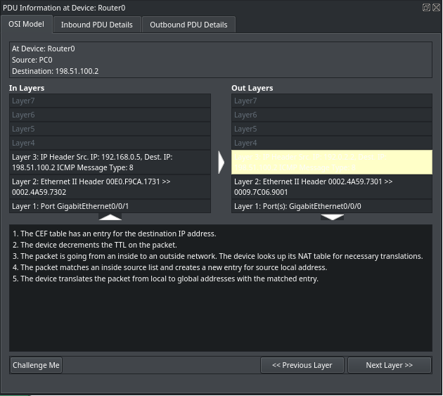
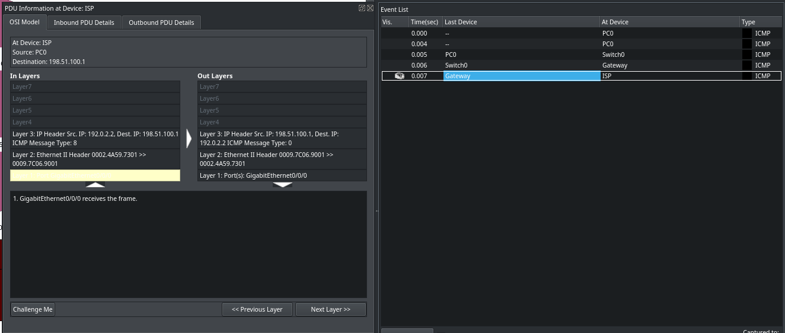

## Concept
Port overloading allows us to let many private hosts use the same public IP address (their router's public IP address) by identifying the hosts' traffic by the router's ports they are using. These ports are assigned to the hosts when they communicate with the internet, and when traffic arrives in the router on that port, it forwards the traffic to the adequete host. (Credits: Me)

## Bullet points
- The Gateway's private hosts are all using the Gateway's public IP address (192.0.2.2)

Screenshot of the project

Router applying NAT to traffic coming from a private host

Here you can see that a private host is communicating with the internet using the Gateway's public IP address when the private host pings an external device.

