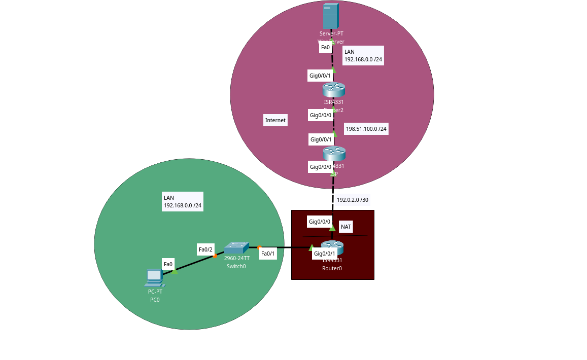

Bullet points:
- I decided not to use RIP here (or anything similar) because for the example I thought it would be unnecessary
- The Gateway has a static Inside Global IP Address (192.0.2.3) for the Inside Local IP Address (192.168.0.5)
- The WebServer's router has a static Inside Global IP Address (198.51.100.5) for the Inside Local IP Address (192.168.0.5 - WebServer's address)

