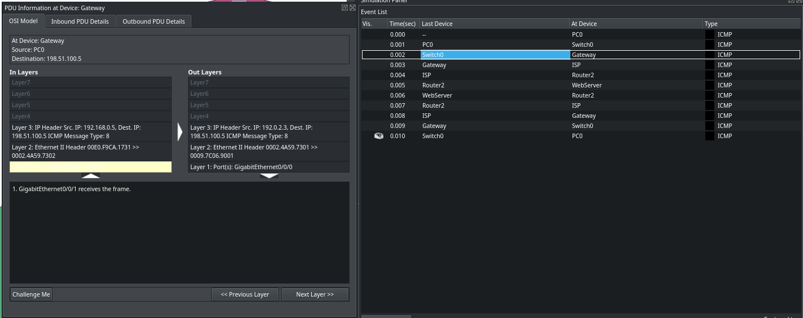

## Concept
Static NAT (Network Address Translation) is a one-to-one mapping of a private IP address to a public IP address. (Credits: [IpWithEase](https://ipwithease.com/nat-types-static-dynamic-and-overload/))

## Bullet points:
- I decided not to use RIP here (or anything similar) because for the example I thought it would be unnecessary
- The Gateway has a static Inside Global IP Address (192.0.2.3) for the Client Host's Inside Local IP Address (192.168.0.5)
- The WebServer's router has a static Inside Global IP Address (198.51.100.5) for the WebServer Host's Inside Local IP Address (192.168.0.5)

In the screenshot below, you can see NAT being applied at layer 3 in our Gateway

