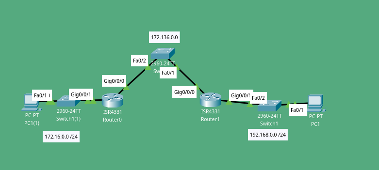
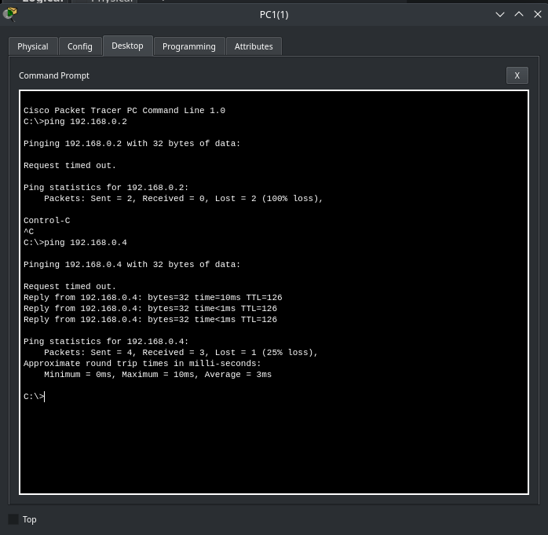

## Concept
Static routing is a form of routing that occurs when a router uses a manually-configured routing entry, rather than information from dynamic routing traffic. (Credits: [Wikipedia](https://en.wikipedia.org/wiki/Static_routing))

## Bullet points:
- Router from 172.16.0.0 has a static route configured to 192.168.0.0 (the next hop is the router from 192.168.0.0)
- Router from 192.168.0.0 has a static route configured to 172.16.0.0 (the next hop is the router from 172.16.0.0)
- For clarification we are going to call 172.16.0.0's Router as RouterLeft
- For clarification we are going to call 192.168.0.0's Router as RouterRight
- RouterLeft's PC owns the IP address: 172.16.0.2
- RouterRight's PC owns the IP address: 192.168.0.4

172.16.0.0's Routing Table
```
Gateway of last resort is not set

     172.16.0.0/16 is variably subnetted, 2 subnets, 2 masks
C       172.16.0.0/24 is directly connected, GigabitEthernet0/0/1
L       172.16.0.1/32 is directly connected, GigabitEthernet0/0/1
     172.136.0.0/16 is variably subnetted, 2 subnets, 2 masks
C       172.136.0.0/24 is directly connected, GigabitEthernet0/0/0
L       172.136.0.1/32 is directly connected, GigabitEthernet0/0/0
S    192.168.0.0/24 [1/0] via 172.136.0.2
```

192.168.0.0's Routing Table
```
     172.16.0.0/24 is subnetted, 1 subnets
S       172.16.0.0/24 [1/0] via 172.136.0.1
     172.136.0.0/16 is variably subnetted, 2 subnets, 2 masks
C       172.136.0.0/24 is directly connected, GigabitEthernet0/0/0
L       172.136.0.2/32 is directly connected, GigabitEthernet0/0/0
     192.168.0.0/24 is variably subnetted, 2 subnets, 2 masks
C       192.168.0.0/24 is directly connected, GigabitEthernet0/0/1
L       192.168.0.1/32 is directly connected, GigabitEthernet0/0/1
```


Here you can see RouterLeft's PC being able to ping RouterRight's PC

